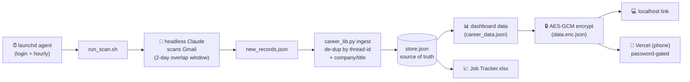

<div align="center">

# 🧭 Career Decision Board

### A self-updating job-search command center — it reads your inbox, tracks every application & interview, and tells you what to do next.

*Not just a dashboard. A **decision board** that turns a messy inbox into ranked next-actions.*

[](https://aaryan0909.github.io/JobAppTracker-Gmail2Offers/)
&nbsp;


</div>

> **▶ [Open the live demo](https://aaryan0909.github.io/JobAppTracker-Gmail2Offers/)** — fully interactive, loaded with realistic **anonymized** data. Toggle the time filter, browse the pipeline, insights, network & outreach templates.

## 📸 See it in action


<sub><b>Decision board</b> — ranked next-actions pulled straight from the inbox: active opportunities, offers, stalled apps, contacts to ping.</sub>

| Insights | Pipeline |
|---|---|
|  |  |
| <sub>What's actually converting — interview rate by job family &amp; channel.</sub> | <sub>Stage-by-stage kanban, filterable by time window.</sub> |

<p align="center"><br/><sub>Same board, on your phone.</sub></p>

---

## The problem

Job searching at volume is a data problem disguised as an inbox problem. Confirmations, interview invites, rejections, and job alerts pile up in Gmail. By week three you can't answer simple questions:

- Which **kinds of roles** actually convert to interviews for me?
- What's **stalled** and should be re-engaged or dropped?
- **Who** have I talked to that I should follow up with?
- What should I **do today**?

I wanted a system that answers those automatically — and keeps answering, every day, without me touching it.

## What it does

| | |
|---|---|
| 📥 **Reads Gmail on a schedule** | Classifies every job-related email: application confirmations, interview/assessment invites, rejections, and job alerts. |
| 🗂️ **Builds a living pipeline** | Every application & interview round, de-duplicated and stage-tracked, in a spreadsheet **and** a web dashboard. |
| 📊 **Computes what's working** | Interview-conversion rate **by job family, channel (ATS), and seniority** — so effort goes where it pays off. |
| 🎯 **Ranks next-actions** | A "decision board": active opportunities, offers, stalled apps to re-engage, warm contacts to ping, and leads worth applying to. |
| 🤝 **Tracks your network** | Recruiters / hiring managers / interviewers auto-extracted from threads, with warmth + last-touch. |
| ✉️ **Outreach templates** | Recruiter intros, follow-ups, thank-yous, referral asks — one tap to copy. |
| ⏱️ **Time filter** | View everything for the last week / month / 3 months / year — hide stale applications instantly. |
| 📱 **Works everywhere** | A local link on the laptop (zero friction) and a password-protected, end-to-end-encrypted view on the phone. |
| ♻️ **Runs itself** | A scheduled agent refreshes Gmail → spreadsheet → dashboards every hour. No manual step. |

## How it works



**Key design decisions**

- **Idempotent, overlapping scans.** Each run searches `after:(last_scan − 2 days)` and de-duplicates by Gmail **thread-id** + normalized `company/title`. This fixed an early bug where same-day scans silently skipped emails. Re-running is always safe.
- **Placeholder-aware de-dup.** Distinct applications with unknown titles aren't collapsed; true duplicates (e.g. `"&"` vs `"and"`) are. (Learned the hard way — see the evolution below.)
- **LLM for extraction, Python for truth.** Claude turns messy emails into structured records; deterministic Python owns de-dup, analytics, recommendations, and I/O. Each plays to its strengths.
- **Privacy-first deployment.** The dashboard payload is **AES-GCM encrypted (PBKDF2-SHA256, 200k iters)** client-side. The public URL only ever serves an encrypted blob; it decrypts in the browser with a password. Plaintext never leaves the machine.

## Tech stack

**Engine** Python 3 (`openpyxl`, `cryptography`) · **Dashboard** single-file vanilla HTML/CSS/JS + Web Crypto API · **Automation** macOS `launchd` (scheduled scan + always-on local server) · **Email** Gmail via MCP, driven by headless Claude · **Hosting** Vercel (encrypted) + GitHub Pages (demo).

## The evolution (why it looks like this)

1. **v0 — manual.** "Scan my inbox and fill a spreadsheet." Worked once; useless the next day.
2. **v1 — the gap.** A naïve daily scan only looked at *today*, so emails that arrived after a run were lost forever. → Rebuilt around an **overlapping window + thread-id de-dup**.
3. **v2 — make it autonomous.** Wanted it to run with zero prompting. Hit two real walls:
   - **macOS TCC** blocks `launchd` agents from `~/Desktop`. → Relocated everything to `~/career-tracker`; the Desktop keeps a symlink + a one-click bookmark.
   - **Wrong Python.** The agent's `PATH` picked a Python without `cryptography`. → Pinned the system interpreter; made encryption a graceful optional.
4. **v3 — a decision board, not a dashboard.** Added conversion analytics by segment, a recommendations engine, network tracking, outreach templates, and job-alert leads scored against my strongest families.
5. **v4 — anywhere, private.** Hourly scans, a time filter, and a phone deployment that's public-URL-but-encrypted.

## Areas for improvement (honest roadmap)

- **Two-way editing** from the dashboard (currently the spreadsheet/scan is the writer).
- **Smarter extraction** for non-ATS / forwarded threads; confidence scores on flagged rows.
- **Calendar integration** to auto-pull interview times and set prep reminders.
- **Cross-platform** (the automation is macOS `launchd`; a `cron`/systemd variant would generalize it).
- **Lead enrichment** — pull JD text for alert leads and rank fit against a résumé embedding.
- **Tests** — the dedup/analytics core is pure functions and is begging for a unit-test suite.

## Repo structure

```
career-tracker/
├── engine/
│   ├── career_lib.py      # classification, analytics, recommendations, encryption, exporters
│   ├── scan_prompt.md     # instructions the headless scanner follows
│   ├── run_scan.sh        # orchestrator (lock, scan, ingest, render, deploy)
│   ├── deploy.sh          # push encrypted build to Vercel
│   ├── load_agents.sh     # (re)load the launchd agents
│   └── anonymize_demo.py  # builds the public demo dataset from real data
├── web/
│   ├── index.html         # the whole dashboard (one file)
│   └── demo-data.json     # anonymized sample data
├── docs/                  # GitHub Pages live demo
├── launchd/               # example LaunchAgent plists
└── careerboard            # control CLI: now | status | logs | open | start | stop
```

> 🔒 **Not in this repo (by design):** real application data, recruiter emails, secrets, and the encryption passphrase are all git-ignored. The repo showcases the **system**; my real board stays private.

## Run it yourself (sketch)

```bash
python3 engine/career_lib.py build      # build dashboard data from a store.json
python3 -m http.server -d web 8765      # open http://localhost:8765/index.html#preview
bash engine/load_agents.sh              # install the hourly scan + local server (macOS)
```

---

<div align="center">
<sub>Built by Aaryan Chawla · MIT licensed · <a href="https://aaryan0909.github.io/JobAppTracker-Gmail2Offers/">live demo</a></sub>
</div>
