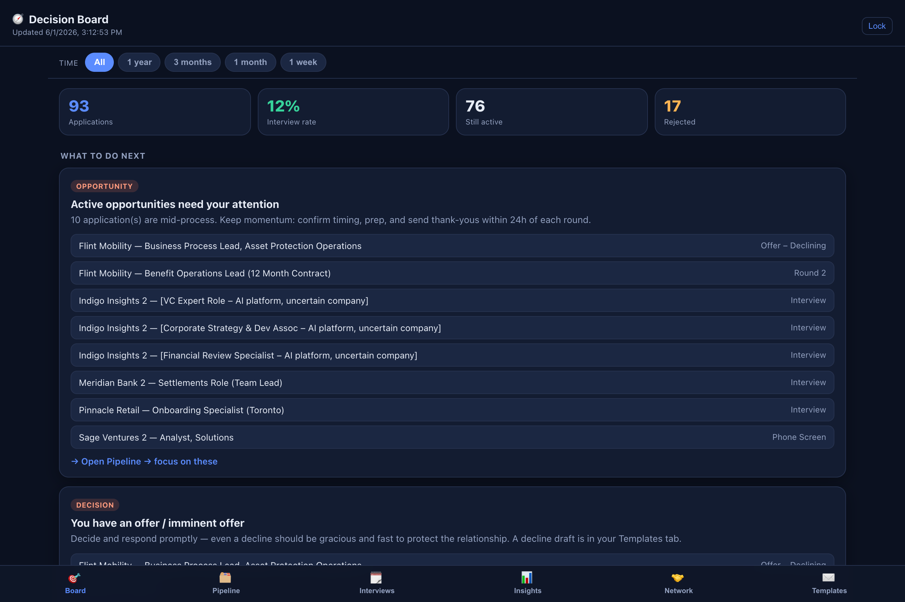
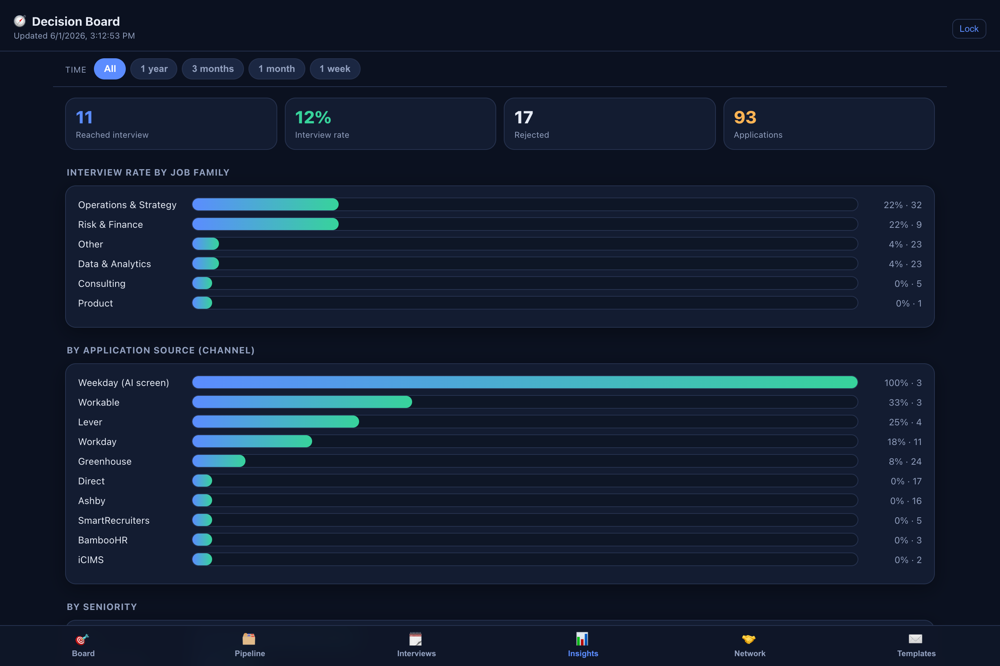
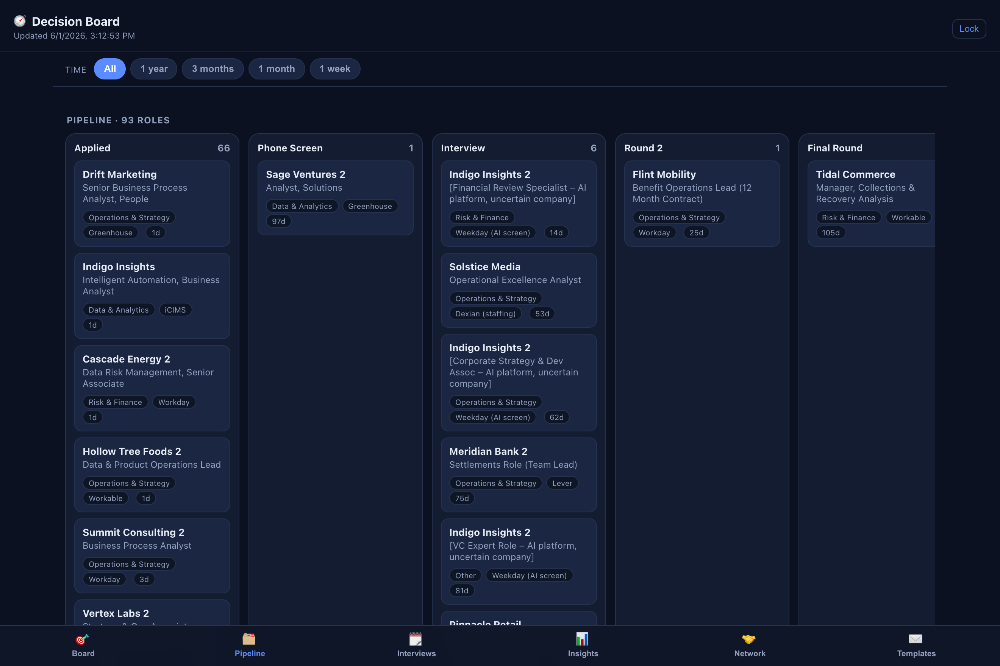
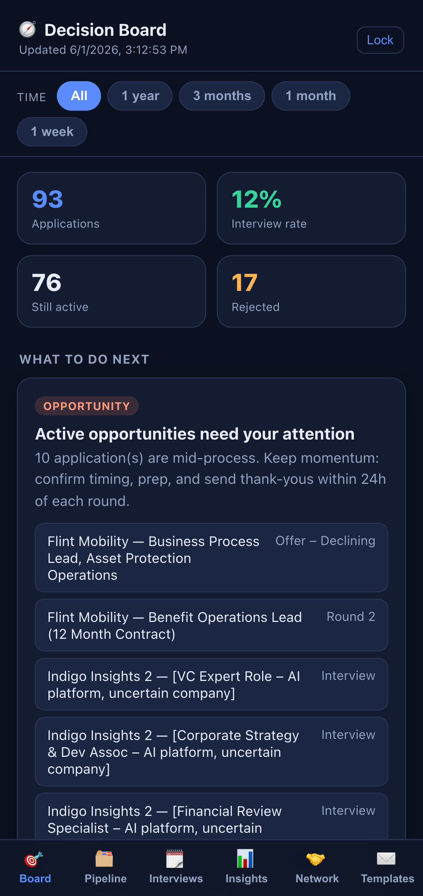
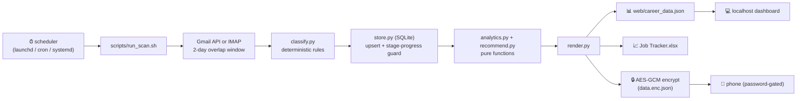

<div align="center">

# 🧭 Career Decision Board

### A self-updating job-search command center — it reads your inbox, tracks every application & interview, and tells you what to do next.

*Not just a dashboard. A **decision board** that turns a messy inbox into ranked next-actions.*

[](https://aaryan0909.github.io/JobAppTracker-Gmail2Offers/)
&nbsp;
[](https://github.com/aaryan0909/JobAppTracker-Gmail2Offers/actions/workflows/ci.yml)


</div>

> **▶ [Open the live demo](https://aaryan0909.github.io/JobAppTracker-Gmail2Offers/)** — fully interactive, loaded with **synthetic sample data** (fictional companies, generated by `engine/seed_demo.py`). Toggle the time filter, browse the pipeline, insights, network & outreach templates.

## 📸 See it in action


<sub><b>Decision board</b> — ranked next-actions pulled straight from the inbox: active opportunities, offers, stalled apps, contacts to ping.</sub>

| Insights | Pipeline |
|---|---|
|  |  |
| <sub>What's actually converting — interview rate by job family & channel.</sub> | <sub>Stage-by-stage kanban, filterable by time window.</sub> |

<p align="center"><br/><sub>Same board, on your phone.</sub></p>

---

## The problem

Job searching at volume is a data problem disguised as an inbox problem. Confirmations, interview invites, rejections, and job alerts pile up in Gmail. By week three you can't answer simple questions:

- Which **kinds of roles** actually convert to interviews for me?
- What's **stalled** and should be re-engaged or dropped?
- **Who** have I talked to that I should follow up with?
- What should I **do today**?

I wanted a system that answers those automatically — and keeps answering, every day, without me touching it.

## What it does

| | |
|---|---|
| 📥 **Reads Gmail on a schedule** | Gmail API (or IMAP + app password). Classifies every job-related email: application confirmations, interview/assessment invites, rejections, offers, recruiter outreach, and job alerts. |
| 🗂️ **Builds a living pipeline** | Every application & interview round, de-duplicated and stage-tracked in **SQLite**, mirrored to a spreadsheet **and** a web dashboard. Stages only move forward — a late email can never regress you. |
| 📊 **Computes what's working** | Interview-conversion rate **by job family, channel (ATS), seniority, and sector** — so effort goes where it pays off. |
| 🎯 **Ranks next-actions** | A "decision board": active opportunities, offers, stalled apps to re-engage, warm contacts to ping, and leads worth applying to. |
| 🤝 **Tracks your network** | Recruiters / hiring managers auto-extracted from threads, with warmth + last-touch. |
| ✉️ **Outreach templates** | Recruiter intros, follow-ups, thank-yous, referral asks — one tap to copy. |
| ⏱️ **Time filter + live refresh** | View the last week / month / 3 months / year. The board shows data freshness and picks up new scans automatically. |
| 🔒 **Private by construction** | The phone deployment serves only an **AES-256-GCM encrypted blob** (PBKDF2-SHA256, 200k iterations); it decrypts in your browser. Plaintext never leaves your machine. |
| ♻️ **Runs itself** | A scheduled agent refreshes Gmail → store → dashboards hourly. No manual step. |

## Try it in 2 minutes (sample data)

```bash
git clone https://github.com/aaryan0909/JobAppTracker-Gmail2Offers.git
cd JobAppTracker-Gmail2Offers
python -m engine.cli seed     # loads clearly-labeled synthetic data
python -m engine.cli build    # rebuilds the dashboard
python3 -m http.server 8765 --directory web
# open http://localhost:8765/index.html#preview
```

Connect your own Gmail instead: **[docs/SETUP.md](docs/SETUP.md)** — Gmail API OAuth or app-password IMAP, schedulers (launchd / cron / systemd), and dashboard deploys.

## How it works



**Key design decisions**

- **Idempotent, overlapping scans.** Each run searches `after:(last_scan − 2 days)` and de-duplicates on write by Gmail **thread-id** + normalized `company/title`. Re-running is always safe.
- **Stages only move forward.** A stage-progress guard means a late-arriving "Applied" email can never overwrite "Interview". Terminal states (Rejected/Withdrawn/Declined) always win.
- **Rules first, LLM optional.** Email classification is deterministic and unit-tested; an LLM second pass is supported (writes `new_records.json`, merged by the same path) but never required.
- **One config file.** Gmail queries, classification keywords, stage order, thresholds, and templates all live in `config.json` — adapting the board means editing JSON, not Python.
- **SQLite, not a JSON blob.** Merge semantics are enforced by the schema (unique indexes), not by careful list manipulation.
- **Privacy by construction.** Real data, credentials, and the passphrase are git-ignored. The public demo is synthetic or scrubbed; the phone deployment serves only ciphertext.

More: **[docs/ARCHITECTURE.md](docs/ARCHITECTURE.md)** · **[docs/SETUP.md](docs/SETUP.md)**

## Tech stack

**Engine** Python 3.9+ (stdlib core: `sqlite3`, `imaplib`, `unittest`; optional `openpyxl`, `cryptography`, Gmail API client) · **Store** SQLite · **Dashboard** single-file vanilla HTML/CSS/JS + Web Crypto API · **Automation** launchd / cron / systemd · **Email** Gmail API or IMAP · **Hosting** GitHub Pages (demo) + Vercel.

## Repo structure

```
├── config.json            # THE config: gmail queries, keywords, stages, thresholds, templates
├── careerboard            # control CLI: now | build | seed | status | logs | open | start | stop | test
├── engine/
│   ├── cli.py             # entrypoint: init | scan [--imap] | ingest | build | xlsx | seed | migrate | cursor | demo
│   ├── config.py          # config loading + validation, stage-rank helpers
│   ├── classify.py        # email → event classification, company/title extraction, dedup keys
│   ├── store.py           # SQLite store: idempotent upserts, scan cursor
│   ├── ingest_gmail.py    # Gmail API scanner (OAuth)
│   ├── ingest_imap.py     # IMAP scanner (app password, stdlib only)
│   ├── analytics.py       # enrich, segment stats, metrics, networking queue (pure)
│   ├── recommend.py       # ranked next-actions engine (pure)
│   ├── crypto.py          # AES-GCM encrypt/decrypt
│   ├── render.py          # dashboard payload, encrypted blob, xlsx mirror
│   ├── seed_demo.py       # synthetic sample data
│   └── anonymize_demo.py  # scrubbed demo from your real store
├── tests/                 # unittest suite: classify, analytics, store (61 tests)
├── scripts/               # run_scan.sh, deploy.sh, install_launchd.sh
│                          # (engine/run_scan.sh, deploy.sh, load_agents.sh are identical
│                          #  copies so pre-existing automation keeps working)
├── scheduler/             # cron.example, systemd service + timer
├── launchd/               # templated LaunchAgent plists (filled in by install script)
├── web/                   # the dashboard (single-file vanilla JS) + demo data
├── docs/                  # GitHub Pages demo + SETUP.md + ARCHITECTURE.md
└── .github/workflows/     # CI: tests on 3.9–3.13 + seed→build smoke test
```

> 🔒 **Not in this repo (by design):** real application data, credentials, tokens, the encryption passphrase, and anything under `engine/archive/` are all git-ignored. The repo showcases the **system**; real boards stay private.

## Deploy the dashboard

- **GitHub Pages** — serves `docs/` (the live demo). Settings → Pages → Deploy from branch → `main` / `docs`.
- **Vercel** — [](https://vercel.com/new/clone?repository-url=https%3A%2F%2Fgithub.com%2Faaryan0909%2FJobAppTracker-Gmail2Offers) — set **Root Directory** to `web` when prompted (deploys the demo).
- **Private** — `python -m engine.cli build` writes the encrypted `web/data.enc.json`; deploy `web/` anywhere static. Password-gated, plaintext never leaves your machine.

## The evolution (why it looks like this)

1. **v0 — manual.** "Scan my inbox and fill a spreadsheet." Worked once; useless the next day.
2. **v1 — the gap.** A naïve daily scan only looked at *today*, so emails that arrived after a run were lost forever. → Rebuilt around an **overlapping window + thread-id de-dup**.
3. **v2 — make it autonomous.** Wanted it to run with zero prompting. Hit two real walls:
   - **macOS TCC** blocks `launchd` agents from `~/Desktop`. → Relocated everything out of Desktop.
   - **Wrong Python.** The agent's `PATH` picked a Python without `cryptography`. → Encryption became a graceful optional.
4. **v3 — a decision board, not a dashboard.** Added conversion analytics by segment, a recommendations engine, network tracking, outreach templates, and job-alert leads scored against the strongest families.
5. **v4 — anywhere, private.** Hourly scans, a time filter, and a phone deployment that's public-URL-but-encrypted.
6. **v5 — a real template.** Split the monolith into tested modules, SQLite store, a stage-progress guard (killed a real regression bug), Gmail API + IMAP ingestion anyone can set up, one `config.json`, schedulers for launchd/cron/systemd, CI, and setup docs.

## Honest notes

- The **live demo runs on synthetic data** — fictional companies, generated by `engine/seed_demo.py`. It shows what the board looks like, not anyone's real job search.
- Email understanding is **rules-based and deterministic** (keyword classification, sender/subject heuristics). It's genuinely good for ATS mail and fully tested; human-written emails are the known weak spot, which is why an optional LLM second pass is supported.
- There are no user counts, testimonials, or performance claims here beyond what's in the code and tests. The interview-rate math is yours, computed from your inbox.
- macOS is the best-supported platform (launchd + `careerboard` CLI); Linux works via cron/systemd; Windows is documented but not scripted.

## Areas for improvement

- **Two-way editing** from the dashboard (currently the scan/store is the writer).
- **Confidence scores** on flagged rows; smarter extraction for forwarded threads.
- **Calendar integration** to auto-pull interview times and set prep reminders.
- **Lead enrichment** — pull JD text for alert leads and rank fit against a résumé embedding.
- **Windows** scheduler scripting.

---

<div align="center">
<sub>Built by Aaryan Chawla · MIT licensed · <a href="https://aaryan0909.github.io/JobAppTracker-Gmail2Offers/">live demo</a></sub>
</div>
