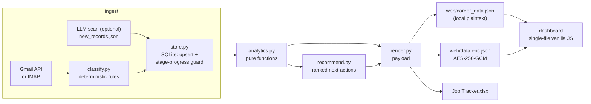

# Architecture

## Pipeline

One command runs the whole thing: `python -m engine.cli scan` (or `scripts/run_scan.sh` for the scheduled version with locking + logging).

## Module map

| Module | Job | Dependencies |
|---|---|---|
| `engine/config.py` | load + validate `config.json`; stage-rank helpers | stdlib |
| `engine/classify.py` | email → event; company/title/source extraction; normalization & dedup keys | stdlib, config |
| `engine/store.py` | SQLite store; idempotent upserts; scan cursor | stdlib (`sqlite3`), classify, config |
| `engine/ingest_gmail.py` | Gmail API fetch + classify | google API client, classify |
| `engine/ingest_imap.py` | IMAP/app-password fetch + classify | stdlib, classify |
| `engine/analytics.py` | enrich, segment stats, metrics, networking queue | stdlib, classify |
| `engine/recommend.py` | ranked next-actions from metrics | analytics, classify |
| `engine/render.py` | dashboard payload, encrypted blob, xlsx mirror | analytics, recommend, crypto, openpyxl |
| `engine/crypto.py` | AES-GCM encrypt/decrypt (PBKDF2-SHA256, 200k iters) | `cryptography` (optional) |
| `engine/seed_demo.py` | synthetic sample data (deterministic seed) | stdlib, store |
| `engine/anonymize_demo.py` | scrubbed demo from a real store | stdlib, store, render |
| `engine/cli.py` | argparse entrypoint: `init/scan/ingest/build/xlsx/seed/migrate/cursor/demo` | all of the above |

`engine/career_lib.py` is a thin backward-compat shim over the new CLI (keeps the old `build|ingest|cursor|xlsx` invocations working).

## Data model (SQLite)

- **applications** — one row per application. Deduped by Gmail `thread_id`, falling back to a normalized `(company, title[, date])` key. Placeholder titles (`[unknown title]`) are disambiguated by date so distinct unknown-title applications never collapse.
- **interviews** — deduped by `thread_id` or `(company, title, date, round)`.
- **contacts** — deduped by email (or name+company when there's no email).
- **leads** — from job-alert emails; deduped by `(company, title)`.
- **templates** — outreach templates, seeded from `config.json`.
- **kv / processed_threads / scans** — scan cursor (`last_scan_iso`), processed thread ids, scan history.

Legacy `store.json` imports via `python -m engine.cli migrate store.json`.

## Design decisions

- **Idempotent, overlapping scans.** Each run searches `after:(last_scan − 2 days)` and de-dupes on write. Re-running is always safe — this fixed an early bug where same-day scans silently skipped emails.
- **Stages only move forward.** `config.should_advance()` guards every stage write: a late or out-of-order email can never regress `Interview` back to `Applied`. Terminal states (`Rejected`, `Withdrawn`, `Declined`) always win. This fixed a real regression bug in the v1 merger.
- **Rules first, LLM optional.** Email understanding is deterministic keyword classification (`classify.py`, fully unit-tested) driven by `config.json`. An LLM pass can refine extraction (see `docs/alternatives/llm-scan.md`), but the pipeline never depends on one — deterministic Python owns de-dup, analytics, recommendations, and I/O.
- **SQLite, not a JSON blob.** The store is a real schema with unique indexes, so merge semantics are enforced by the database instead of by careful list manipulation.
- **Config, not code.** Gmail queries, classification keywords, stage order, thresholds, and templates all live in `config.json`. Adapting the board to a new user means editing JSON, not Python.
- **Privacy by construction.** Real data (`careerboard.db`, `credentials.json`, `token.json`, `career_data.json`, `data.enc.json`, `.passphrase`) is git-ignored. The public demo is either synthetic (`seed_demo.py`) or scrubbed (`anonymize_demo.py`); the phone deployment serves only an AES-GCM blob that decrypts in the browser.
- **Single-file dashboard.** The whole UI is one `web/index.html` (vanilla JS, no build step, no framework) — trivially deployable to GitHub Pages or Vercel, and it auto-refreshes when a scan rebuilds the data.

## What's rules-based vs. what an LLM could improve (honest)

Rules-based today, tested, and good enough for ATS mail: event classification, company/title extraction from sender/subject patterns, source detection, de-dup, analytics, recommendations.

Genuinely harder without an LLM: non-ATS human emails ("let's chat Thursday?" from a hiring manager), forwarded threads, extracting interview times for calendar integration, and judging job-alert fit against a résumé. The `docs/alternatives/llm-scan.md` prompt is the template for that second pass — it writes `new_records.json`, which the normal merge path ingests.

## Testing

`tests/` covers the pure core with stdlib `unittest` (no extra deps):

- `test_classify.py` — normalization, dedup keys, family/seniority rules, email event fixtures (including rejection-beats-interview-mention), the stage-progress guard, extraction heuristics.
- `test_analytics.py` — enrich flags (stale/advanced/rejected), segment math, metrics, networking queue, recommendation ranking.
- `test_store.py` — upsert dedup, stage never regresses, terminal wins, interview/contact/lead dedup, cursor, legacy import round-trip.

CI (`.github/workflows/ci.yml`) runs the suite on Python 3.9–3.13 plus a `seed → build` smoke test.
